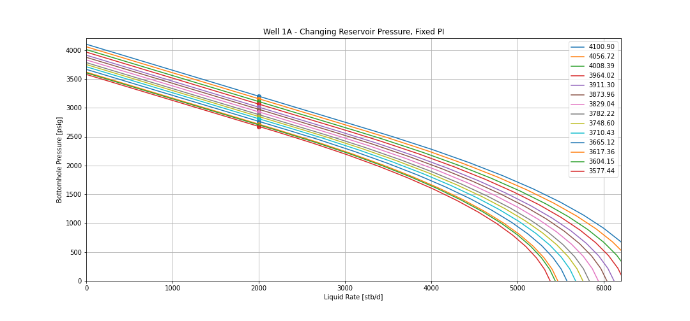

# pyipr
python based inflow performance model (IPR) tool

The IPR in pyipr is a composite model, using the Darcy IPR above the bubble point and Vogel IPR below. 

pyipr uses the Glaso black oil correlation for calculating:
 - bubble point pressure
 - solution gas oil ratio
 - formation volume factor

The Beggs correlation is used for estimating Oil Viscosity

To get started, see the jupyter notebook primer

